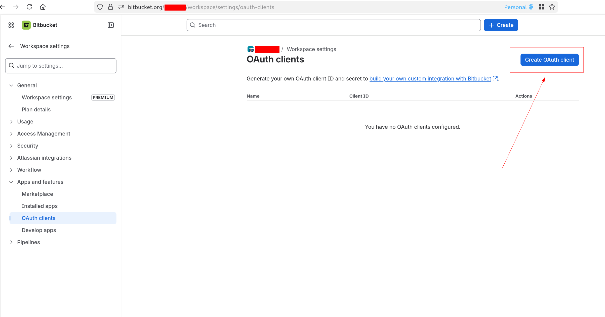

# OAuth Client Setup (Workspace Admin Guide)

This guide is for **Bitbucket workspace admins**. It covers the one-time setup that lets team
members run `bbgo config login` and authenticate as themselves — so pull requests, comments, and
approvals are attributed to the real user, not a bot or service account.

You only do this once per workspace. After that, every team member uses the same client
credentials to log in.

## Why OAuth instead of tokens?

| Method | Attribution | Availability |
|---|---|---|
| Workspace/repo access token | Bot user | Admin-issued |
| Personal API token | Real user | Often blocked by org policy |
| **OAuth login (this guide)** | **Real user** | Works even when API tokens are blocked |

bbgo's login flow is the same pattern as `gcloud auth login`: the CLI opens a browser, the user
signs in (corporate SSO included), and the CLI receives short-lived tokens that act on the user's
behalf. Tokens auto-refresh; users never copy/paste anything.

## Prerequisites

- You are an **admin of the Bitbucket workspace** (you can see *Workspace settings*).
- You know which port the team will use for the login callback. bbgo's default is **8976** —
  keep it unless you have a reason not to.

## Step 1 — Open the OAuth clients page

1. Go to [bitbucket.org](https://bitbucket.org) and open your workspace.
2. Click the workspace avatar → **Workspace settings**.
3. In the left sidebar under **Apps and features**, click **OAuth clients**.
4. Click **Create OAuth client**.



## Step 2 — Fill in the client form

| Field | Value |
|---|---|
| **Name** | `bbgo CLI` (anything recognizable) |
| **Description** | `Team CLI for PRs — users authenticate as themselves` |
| **Callback URL** | `http://localhost:8976/callback` |
| **URL / Website** | Your bbgo repo URL (or team intranet page) |
| **Privacy policy URL** | Same as above — see note below |
| **End user license agreement URL** | Same as above — see note below |
| **Supported grant types** | **Authorization code** only (plus **Refresh token** if listed separately) |
| **This is a private consumer** | ✅ **Checked** (required — enables the secret + refresh tokens) |

> **Do not enable the Client credentials grant.** It lets anyone holding the client secret mint
> tokens that act as the client's *creator* (an admin) with no user consent — recreating the
> bot-attribution problem this setup exists to avoid, and needlessly raising the stakes if the
> secret leaks. bbgo only needs Authorization code (+ refresh).

> **About the URL fields:** these are purely informational — they appear as links on the
> "Grant access" consent screen so end users can see what they're authorizing. Bitbucket does not
> fetch or validate their content. For an internal tool, pointing all of them at the bbgo repo
> (or an internal wiki page describing the tool) is fine; leave blank any the form marks optional.

> **The callback URL must match exactly.** Bitbucket validates it on every login, including the
> port. If you register a different port here, users must pass `--port N` to `bbgo config login`.
> Bitbucket does not support random loopback ports the way Google's OAuth does.

<!-- screenshot: images/add-client-form.png — the Add client form with callback URL and private-client checkbox filled in -->

## Step 3 — Set permissions (scopes)

Under **Permissions**, check:

| Permission | Level | Used by |
|---|---|---|
| Account | Read | `config verify`, identity check after login |
| Repositories | Write | `file get`, repo resolution |
| Pull requests | Write | `pr create`, `comment`, `review approve` / `request-changes` |

Leave everything else unchecked — bbgo does not need Webhooks, Pipelines, Issues, or admin scopes.

<!-- screenshot: images/client-permissions.png — the Permissions checklist with Account/Repositories/Pull requests selected -->

## Step 4 — Save and share the credentials

After saving, the client appears in the list. Click its name to reveal:

- **Key** — this is the *client ID* (not secret; fine to put in a team wiki)
- **Secret** — treat like a password: share via your password manager or secrets tool,
  not chat or email

<!-- screenshot: images/client-key-secret.png — the expanded client row showing Key and Secret -->

## Step 5 — Tell the team

Each member runs, once:

```bash
bbgo config login --client-id <KEY> --client-secret <SECRET>
```

On shared/multi-user machines, prefer environment variables so the secret never appears in `ps`
output:

```bash
export BBGO_OAUTH_CLIENT_ID=<KEY> BBGO_OAUTH_CLIENT_SECRET=<SECRET>
bbgo config login
```

A browser opens; they sign in to Bitbucket (SSO works) and click **Grant access**. bbgo confirms
with:

```
Logged in as Jane Doe (janedoe). PRs and comments will be attributed to this user.
```

The credentials are stored in the OS keychain (encrypted-file fallback), and later re-logins are
just `bbgo config login` — the client ID/secret are remembered. Access tokens expire after ~2 hours
and refresh automatically.

## Troubleshooting

**"cannot listen on port 8976"** — something on the user's machine is using the port. Free it, or
register a second client with a different callback port and use `--port`.

**"redirect_uri mismatch" in the browser** — the callback URL on the client doesn't exactly match
`http://localhost:<port>/callback`. Check scheme (`http`, not `https`), host (`localhost`), port,
and path.

**"OAuth session expired and refresh failed"** — the refresh token was revoked (e.g., the client
was deleted/recreated, or the user revoked access under *Personal settings → Authorized
applications*). Re-run `bbgo config login`.

**User sees "Grant access" for the wrong workspace** — OAuth clients belong to one workspace.
If the team spans multiple workspaces, create one client per workspace.

**Headless machines (SSH, containers, CI)** — the browser flow needs a local browser. For CI, use
the `BBGO_TOKEN` environment variable with whatever credential your pipeline is allowed to use;
attribution to a human user is generally not wanted in CI anyway.

## Security notes

- The client secret lets someone *start* a login flow — it cannot read repositories by itself.
  A user still has to sign in and grant access. Rotate it from the same settings page if it leaks.
- Atlassian's [OAuth 2.0 enforcement changes (May 2026)](https://community.developer.atlassian.com/t/oauth-2-0-and-api-authentication-changes-for-bitbucket-cloud/99003)
  require exact redirect URI matching and rotate refresh tokens on every refresh. bbgo handles both.
- Tokens and the client secret never appear in bbgo output — they are registered with the
  output redaction layer.
